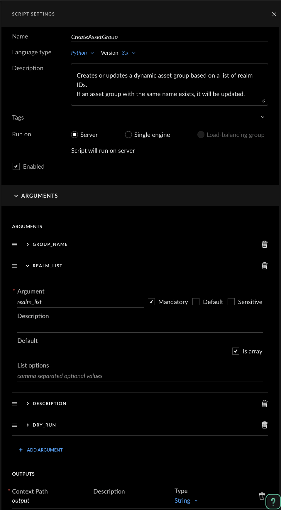

# Cortex XSIAM/XSOAR Custom Scripts

This repository contains custom automation scripts for Cortex Cloud. These scripts work together to filter AWS accounts by name pattern and create dynamic asset groups based on the results.


---

## How to Create Scripts in Cortex

1. In Cortex, navigate to **Investigation & Response → Automation → Scripts**
2. Click the **+ New Script** button in the top right corner
3. Delete the example code and paste the script content from this repository
4. Configure the script settings in the right panel (described below for each script)
5. Click **Save** when done

---

## Script 1: GetAWSRealms

Executes an XQL query against the asset inventory to retrieve AWS account realm IDs (account IDs) filtered by account name pattern.

### Script Settings

| Field | Value |
|-------|-------|
| **Name** | `GetAWSRealms` |
| **Description** | Executes XQL query against asset_inventory to extract xdm.asset.realm values for AWS accounts filtered by name. |

### Input Arguments

| Argument | Type | Required | Default | Description |
|----------|------|----------|---------|-------------|
| `filter_keyword` | String | Yes | `SOC` | Keyword to filter AWS account names (e.g., "SOC", "Production") |

> **Tip:** Check the "Mandatory" checkbox to prevent execution without this argument. You can also set a default value if it applies to your use case.

### Output

| Context Path | Type | Description |
|--------------|------|-------------|
| `GetAWSRealms.values` | List | List of AWS realm IDs (account IDs) matching the filter |
| `GetAWSRealms.status` | String | Query execution status (SUCCESS/PENDING/FAILED) |
| `GetAWSRealms.results_count` | Number | Count of realms found |
| `GetAWSRealms.filter_keyword` | String | The filter keyword used |

### Configuration Screenshot Reference


---

## Script 2: CreateAssetGroup

Creates or updates a dynamic asset group in Cortex XSIAM based on a list of realm IDs. If a group with the specified name already exists, it will be updated; otherwise, a new group is created.

### Script Settings

| Field | Value |
|-------|-------|
| **Name** | `CreateAssetGroup` |
| **Description** | Creates or updates a dynamic asset group based on a list of realm IDs. Supports dry-run mode to preview changes. |

### Input Arguments

| Argument | Type | Required | Default | Description |
|----------|------|----------|---------|-------------|
| `group_name` | String | Yes | — | Name of the asset group to create or update |
| `realm_list` | String | Yes | — | List of realm IDs (can use output from GetAWSRealms) |
| `group_description` | String | No | *Auto-generated* | Description for the asset group |
| `dry_run` | Boolean | No | `false` | If true, only shows what would be done without making changes |

> **Important:** For the `realm_list` argument, you must enable the **"Is array"** checkbox in the UI. This allows the script to receive a list of values instead of a single string.

> **Tip:** For `realm_list`, you can reference the output from GetAWSRealms using the context path `${GetAWSRealms.values}` when chaining the scripts in a playbook.

### Output

| Context Path | Type | Description |
|--------------|------|-------------|
| `CreateAssetGroup.group_id` | String | The asset group ID |
| `CreateAssetGroup.group_name` | String | The asset group name |
| `CreateAssetGroup.action` | String | Action performed (created/updated/would be created/would be updated) |
| `CreateAssetGroup.realm_count` | Number | Number of realms included in the group |
| `CreateAssetGroup.status` | String | Execution status (success/dry_run) |

### Configuration Screenshot Reference



---

## Usage Example: Chaining Scripts in a Playbook

These scripts are designed to work together. A typical workflow:

1. **Run GetAWSRealms** with a filter keyword (e.g., "SOC") to get the list of AWS account realm IDs
2. **Run CreateAssetGroup** using the realm list from step 1 to create/update a dynamic asset group

### Example Playbook Flow

```
┌─────────────────────────────────────┐
│         GetAWSRealms                │
│   filter_keyword: "SOC"             │
│   Output: GetAWSRealms.values       │
└──────────────────┬──────────────────┘
                   │
                   ▼
┌─────────────────────────────────────┐
│       CreateAssetGroup              │
│   group_name: "SOC AWS Accounts"    │
│   realm_list: ${GetAWSRealms.values}│
│   dry_run: false                    │
└─────────────────────────────────────┘
```

---

## Troubleshooting

### GetAWSRealms returns no results
- Verify the XQL query works directly in Cortex XQL console
- Check that the filter_keyword matches actual account names
- Ensure the XDR - XQL Query Engine integration is properly configured

### CreateAssetGroup fails with API errors
- Verify you have permissions to create/modify asset groups
- Check that the realm_list is not empty
- Use `dry_run: true` first to preview what would be created

### Query times out (PENDING status)
- The script has a default timeout of 120 seconds
- For large datasets, the query may take longer
- Try running the query directly in the XQL console to estimate execution time

---

## Files in This Repository

| File | Description |
|------|-------------|
| `GetAWSRealms.py` | Script to retrieve AWS realm IDs filtered by account name |
| `CreateAssetGroup.py` | Script to create/update dynamic asset groups |
| `cortex-apis-docs.md` | Reference documentation for Cortex platform APIs |
