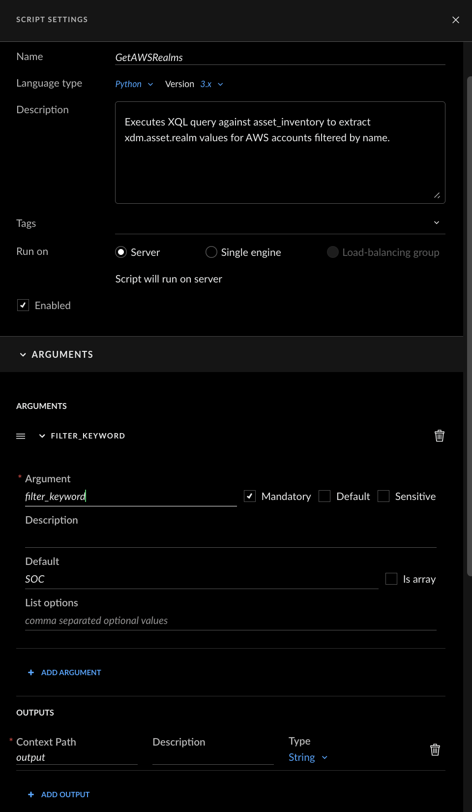

# Cortex Cloud Custom Scripts

This repository contains custom automation scripts for Cortex Cloud. These scripts work together to filter cloud accounts by name pattern and create dynamic asset groups based on the results. Works with any cloud provider (AWS, Azure, GCP).


---

## How to Create Scripts in Cortex

1. In Cortex, navigate to **Investigation & Response → Automation → Scripts**
2. Click the **+ New Script** button in the top right corner
3. Delete the example code and paste the script content from this repository
4. Configure the script settings in the right panel (described below for each script)
5. Click **Save** when done

---

## Script 1: GetCloudAccounts

Retrieves cloud account IDs filtered by account name using the Cloud Onboarding APIs. Works with any cloud provider (AWS, Azure, GCP) based on the integration instance.

### Script Settings

| Field | Value |
|-------|-------|
| **Name** | `GetCloudAccounts` |
| **Description** | Retrieves cloud account IDs filtered by account name using Cloud Onboarding APIs. Works with any cloud provider. |

### Input Arguments

| Argument | Type | Required | Default | Description |
|----------|------|----------|---------|-------------|
| `instance_ids` | Array | Yes | — | One or more cloud integration instance IDs (also known as Connector ID in Cortex Cloud) |
| `filter_keyword` | String | No | — | Filter expression with optional flag prefix (see below) |
| `case_sensitive` | Boolean | No | `false` | Enable case-sensitive matching |
| `debug` | Boolean | No | `false` | Show debug info in output |

> **Important:** For the `instance_ids` argument, enable the **"Is array"** checkbox in the script configuration to accept multiple values.

### Filter Syntax

| Flag | Example | Description |
|------|---------|-------------|
| (none) | `SOC` | Simple contains match |
| `-r` | `-r ^AWS-SOC.*` | Regex pattern match |
| `-or` | `-or SOC, PROD, DEV` | Match ANY keyword (comma-separated) |
| `-and` | `-and SOC, Production` | Match ALL keywords (comma-separated) |

### Output

| Context Path | Type | Description |
|--------------|------|-------------|
| `GetCloudAccounts.values` | List | List of cloud account IDs matching the filter |
| `GetCloudAccounts.account_names` | List | List of account names matching the filter |
| `GetCloudAccounts.results_count` | Number | Count of accounts found |
| `GetCloudAccounts.instance_ids` | List | The instance IDs queried |
| `GetCloudAccounts.filter_keyword` | String | The filter expression used |
| `GetCloudAccounts.case_sensitive` | Boolean | Whether case-sensitive matching was used |

### Configuration Screenshot Reference



---

## Script 2: CreateAssetGroup

Creates or updates a dynamic asset group in Cortex XSIAM based on a list of realm IDs. If a group with the specified name already exists, it will be updated; otherwise, a new group is created.

### Script Settings

| Field | Value |
|-------|-------|
| **Name** | `CreateAssetGroup` |
| **Description** | Creates or updates a dynamic asset group based on a list of realm IDs. Supports dry-run mode to preview changes. |

### Input Arguments

| Argument | Type | Required | Default | Description |
|----------|------|----------|---------|-------------|
| `group_name` | String | Yes | — | Name of the asset group to create or update |
| `realm_list` | String | Yes | — | List of realm IDs (can use output from GetAWSRealms) |
| `group_description` | String | No | *Auto-generated* | Description for the asset group |
| `dry_run` | Boolean | No | `false` | If true, only shows what would be done without making changes |

> **Important:** For the `realm_list` argument, you must enable the **"Is array"** checkbox in the UI. This allows the script to receive a list of values instead of a single string.

> **Tip:** For `realm_list`, you can reference the output from GetAWSRealms using the context path `${GetAWSRealms.values}` when chaining the scripts in a playbook.

### Output

| Context Path | Type | Description |
|--------------|------|-------------|
| `CreateAssetGroup.group_id` | String | The asset group ID |
| `CreateAssetGroup.group_name` | String | The asset group name |
| `CreateAssetGroup.action` | String | Action performed (created/updated/would be created/would be updated) |
| `CreateAssetGroup.realm_count` | Number | Number of realms included in the group |
| `CreateAssetGroup.status` | String | Execution status (success/dry_run) |

### Configuration Screenshot Reference


---

## Usage Example: Chaining Scripts in a Playbook

These scripts are designed to work together. A typical workflow:

1. **Run GetCloudAccounts** with an instance ID and filter to get the list of cloud account IDs
2. **Run CreateAssetGroup** using the account list from step 1 to create/update a dynamic asset group

### Example Playbook Flow

```
┌───────────────────────────────────────────┐
│           GetCloudAccounts                │
│   instance_ids: ["aws-inst", "gcp-inst"]  │
│   filter_keyword: "-or SOC; PROD"         │
│   Output: GetCloudAccounts.values         │
└────────────────────┬──────────────────────┘
                     │
                     ▼
┌───────────────────────────────────────────┐
│         CreateAssetGroup                  │
│   group_name: "SOC Cloud Accounts"        │
│   realm_list: ${GetCloudAccounts.values}  │
│   dry_run: false                          │
└───────────────────────────────────────────┘
```

---

## Troubleshooting

### GetCloudAccounts returns no results
- Run with `debug="true"` to see detailed API response info
- Verify the instance_id is correct and the integration is active
- Check that the filter_keyword matches actual account names
- If using regex (`-r`), verify the pattern is valid

### CreateAssetGroup fails with API errors
- Verify you have permissions to create/modify asset groups
- Check that the realm_list is not empty
- Use `dry_run: true` first to preview what would be created

### API returns fewer accounts than expected
- The script automatically handles pagination to fetch all accounts
- Run with `debug="true"` to see pagination details

---

## Files in This Repository

| File | Description |
|------|-------------|
| `GetCloudAccounts.py` | Script to retrieve cloud account IDs filtered by account name |
| `CreateAssetGroup.py` | Script to create/update dynamic asset groups |
| `cortex-apis-docs.md` | Reference documentation for Cortex platform APIs |
| `cortex-cloud-onboarding-apis-docs.md` | Reference documentation for Cloud Onboarding APIs |
