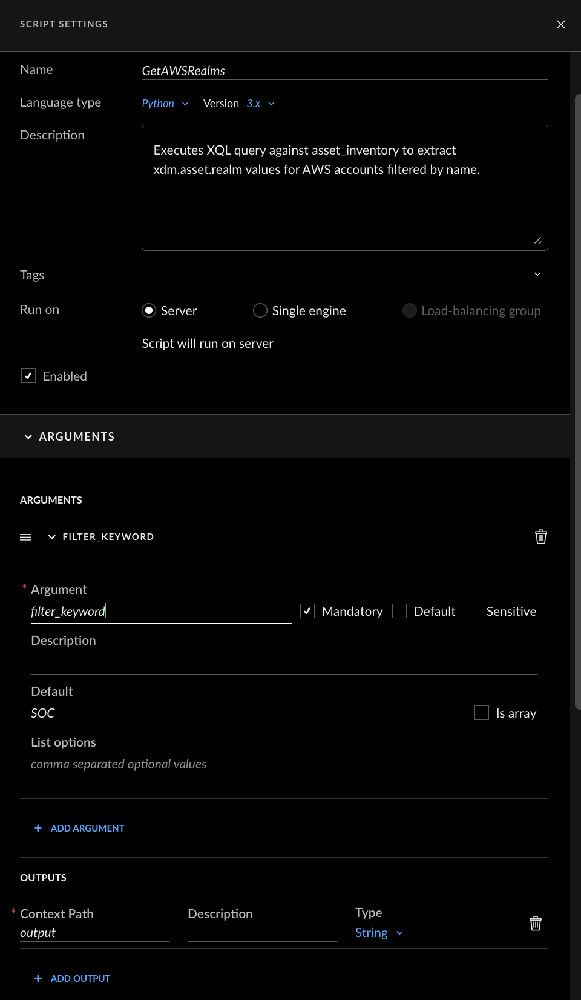
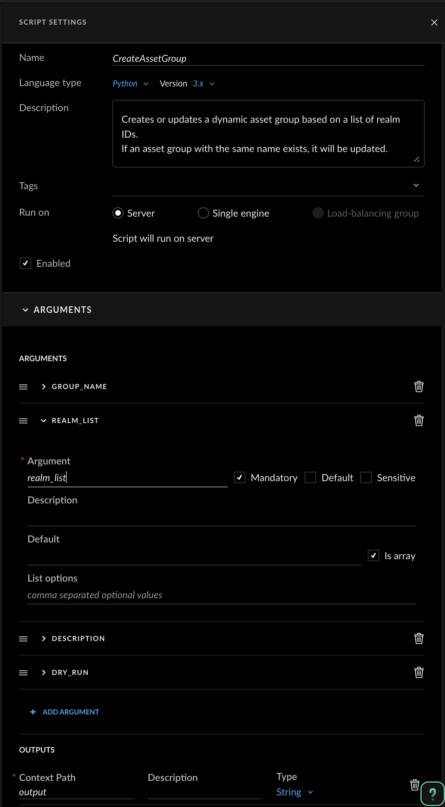

# Cortex Cloud Custom Scripts

This repository contains custom automation scripts for Cortex Cloud. These scripts work together to filter cloud accounts — by name or by tag — and create dynamic asset groups based on the results. Works with any cloud provider (AWS, Azure, GCP).

There are two ways to select accounts, each paired with the same `CreateAssetGroup` script:

- **By name:** `GetCloudAccounts` (Cloud Onboarding APIs, filters on account name)
- **By tag:** `GetCloudAccountsByTag` (Assets API, filters on a tag key/value)


---

## How to Create Scripts in Cortex

1. In Cortex, navigate to **Investigation & Response → Automation → Scripts**
2. Click the **+ New Script** button in the top right corner
3. Delete the example code and paste the script content from this repository
4. Configure the script settings in the right panel (described below for each script)
5. Click **Save** when done

---

## Script 1: GetCloudAccounts

Retrieves cloud account IDs filtered by account name using the Cloud Onboarding APIs. Works with any cloud provider (AWS, Azure, GCP) based on the integration instance.

### Script Settings

| Field | Value |
|-------|-------|
| **Name** | `GetCloudAccounts` |
| **Description** | Retrieves cloud account IDs filtered by account name using Cloud Onboarding APIs. Works with any cloud provider. |

### Input Arguments

| Argument | Type | Required | Default | Description |
|----------|------|----------|---------|-------------|
| `instance_ids` | Array | Yes | — | One or more cloud integration instance IDs (also known as Connector ID in Cortex Cloud) |
| `filter_keyword` | String | No | — | Filter expression with optional flag prefix (see below) |
| `case_sensitive` | Boolean | No | `false` | Enable case-sensitive matching |
| `debug` | Boolean | No | `false` | Show debug info in output |

> **Important:** For the `instance_ids` argument, enable the **"Is array"** checkbox in the script configuration to accept multiple values.

### Filter Syntax

| Flag | Example | Description |
|------|---------|-------------|
| (none) | `SOC` | Simple contains match |
| `-r` | `-r ^AWS-SOC.*` | Regex pattern match |
| `-or` | `-or SOC, PROD, DEV` | Match ANY keyword (comma-separated) |
| `-and` | `-and SOC, Production` | Match ALL keywords (comma-separated) |

### Output

| Context Path | Type | Description |
|--------------|------|-------------|
| `GetCloudAccounts.values` | List | List of cloud account IDs matching the filter |
| `GetCloudAccounts.account_names` | List | List of account names matching the filter |
| `GetCloudAccounts.results_count` | Number | Count of accounts found |
| `GetCloudAccounts.instance_ids` | List | The instance IDs queried |
| `GetCloudAccounts.filter_keyword` | String | The filter expression used |
| `GetCloudAccounts.case_sensitive` | Boolean | Whether case-sensitive matching was used |

### Configuration Screenshot Reference



---

## Script 1b: GetCloudAccountsByTag

Retrieves cloud account IDs (AWS Account, Azure Subscription, GCP Project) that carry a specific tag, using the Assets API (`/public_api/v1/assets`). The asset types scanned are fixed (`ASSET_TYPES` in the script) and are not exposed as a Cortex argument.

Tags are **not** all returned the same way by the platform:

| Provider | Where tags live | How this script gets them |
|----------|------------------|----------------------------|
| Azure Subscription | Inline, in `xdm.asset.tags` on the asset returned by `/public_api/v1/assets` | Read directly, no extra call |
| AWS Account | `raw_fields` only — `xdm.asset.raw_fields["Platform Discovery"]["Tags"]` (list of `{Key, Value}`) | One extra `core-api-get` call per account to `/public_api/v1/assets/{asset_id}/raw_fields` |
| GCP Project | `raw_fields` only — `xdm.asset.raw_fields["Platform Discovery"]["labels"]` (object) | Same as AWS, different field name |

The extra per-account calls for AWS/GCP are made in parallel (thread pool) so this stays reasonably fast on large fleets — see `max_workers` below. Which asset types need the extra call is defined in the `TAG_SOURCE_BY_TYPE` constant in the script; if a provider's tag location ever changes, that's the only place to update.

### Script Settings

| Field | Value |
|-------|-------|
| **Name** | `GetCloudAccountsByTag` |
| **Description** | Retrieves cloud account IDs filtered by tag key/value using the Assets API. Works with AWS, Azure and GCP. |

### Input Arguments

| Argument | Type | Required | Default | Description |
|----------|------|----------|---------|-------------|
| `tag_key` | String | Yes | — | Tag key to look for |
| `tag_value` | Array | No | — | Tag values to match (any of them). If empty, any account with the key matches, regardless of value |
| `case_sensitive` | Boolean | No | `false` | Enable case-sensitive matching on key and value |
| `max_workers` | Number | No | `10` | Parallel threads used for the AWS/GCP `raw_fields` lookups (capped at 25). Set to `1` for sequential calls if concurrent `core-api-get`/`core-api-post` calls prove unreliable in your tenant |
| `debug` | Boolean | No | `false` | Show debug info (pagination, raw_fields fetch stats, failures) in output |

> **Important:** For the `tag_value` argument, enable the **"Is array"** checkbox in the script configuration to accept multiple values.
>
> Asset types (AWS Account, Azure Subscription, GCP Project) are hardcoded in the script (`ASSET_TYPES` constant) and are intentionally not a configurable argument.
>
> **Limitation:** because `tag_value` is an array, commas are treated as value separators. A tag whose value literally contains a comma (e.g. `Sales, Marketing`) is read as two separate values and cannot be matched literally.

### Output

| Context Path | Type | Description |
|--------------|------|--------------|
| `GetCloudAccountsByTag.values` | List | List of `xdm.asset.cloud.account.id` matching the tag (deduplicated) |
| `GetCloudAccountsByTag.account_names` | List | List of matching account names |
| `GetCloudAccountsByTag.results_count` | Number | Count of accounts found |
| `GetCloudAccountsByTag.tag_key` | String | The tag key used |
| `GetCloudAccountsByTag.tag_value` | List | The tag values used |
| `GetCloudAccountsByTag.failed_lookups` | List | Account IDs whose `raw_fields` call failed — **excluded** from `values`. Review these before trusting the result; a failed account may actually have the tag |

### A note on `raw_fields` cost and script timeout

For AWS and GCP, every account of that type in scope gets an individual `raw_fields` call — tags can't be filtered server-side for those providers, only fetched account by account. On large fleets this is the slowest part of the script; use `debug=true` on the first run to see how many calls were made, how many returned no data, and whether any failed.

Rough wall-clock estimate, assuming ~0.3s per call:

| AWS/GCP accounts | `max_workers=10` | `max_workers=25` |
|------------------|------------------|------------------|
| 200 | ~6s | ~2s |
| 1,000 | ~30s | ~12s |
| 5,000 | ~150s | ~60s |

> **Important:** on AWS-heavy tenants this can exceed the script's execution timeout. Raise the **timeout** value in the script configuration in Cortex to comfortably cover the estimate above for your account count, otherwise the script is killed mid-run and the playbook gets no result.

---

## Script 2: CreateAssetGroup

Creates or updates a dynamic asset group in Cortex XSIAM based on a list of realm IDs. If a group with the specified name already exists, it will be updated; otherwise, a new group is created.

### Script Settings

| Field | Value |
|-------|-------|
| **Name** | `CreateAssetGroup` |
| **Description** | Creates or updates a dynamic asset group based on a list of realm IDs. Supports dry-run mode to preview changes. |

### Input Arguments

| Argument | Type | Required | Default | Description |
|----------|------|----------|---------|-------------|
| `group_name` | String | Yes | — | Name of the asset group to create or update |
| `realm_list` | String | Yes | — | List of realm IDs (can use output from GetAWSRealms) |
| `group_description` | String | No | *Auto-generated* | Description for the asset group |
| `dry_run` | Boolean | No | `false` | If true, only shows what would be done without making changes |

> **Important:** For the `realm_list` argument, you must enable the **"Is array"** checkbox in the UI. This allows the script to receive a list of values instead of a single string.

> **Tip:** For `realm_list`, you can reference the output from GetAWSRealms using the context path `${GetAWSRealms.values}` when chaining the scripts in a playbook.

### Output

| Context Path | Type | Description |
|--------------|------|-------------|
| `CreateAssetGroup.group_id` | String | The asset group ID |
| `CreateAssetGroup.group_name` | String | The asset group name |
| `CreateAssetGroup.action` | String | Action performed (created/updated/would be created/would be updated) |
| `CreateAssetGroup.realm_count` | Number | Number of realms included in the group |
| `CreateAssetGroup.status` | String | Execution status (success/dry_run) |

### Configuration Screenshot Reference



---

## Usage Example: Chaining Scripts in a Playbook

Both account-selection scripts feed the same `CreateAssetGroup` script; pick whichever matches how you want to select accounts. A typical workflow:

1. **Run GetCloudAccounts or GetCloudAccountsByTag** to get the list of cloud account IDs
2. **Run CreateAssetGroup** using the account list from step 1 to create/update a dynamic asset group

> Because `xdm.asset.realm` equals `xdm.asset.cloud.account.id` for AWS, Azure and GCP account-level assets, the account IDs returned by either script can be passed straight into `CreateAssetGroup`'s `realm_list`.

### Example Playbook Flow — by name

```
┌───────────────────────────────────────────┐
│           GetCloudAccounts                │
│   instance_ids: ["aws-inst", "gcp-inst"]  │
│   filter_keyword: "-or SOC; PROD"         │
│   Output: GetCloudAccounts.values         │
└────────────────────┬──────────────────────┘
                     │
                     ▼
┌───────────────────────────────────────────┐
│         CreateAssetGroup                  │
│   group_name: "SOC Cloud Accounts"        │
│   realm_list: ${GetCloudAccounts.values}  │
│   dry_run: false                          │
└───────────────────────────────────────────┘
```

### Example Playbook Flow — by tag

```
┌─────────────────────────────────────────────┐
│         GetCloudAccountsByTag               │
│   tag_key: "c7n-product"                    │
│   tag_value: ["Sales"]                      │
│   Output: GetCloudAccountsByTag.values      │
└────────────────────┬────────────────────────┘
                     │
      ┌──────────────┴───────────────┐
      │ results_count > 0 ?           │
      └──────────────┬───────────────┘
                     │ yes
                     ▼
┌───────────────────────────────────────────────┐
│            CreateAssetGroup                    │
│   group_name: "Sales Cloud Accounts"          │
│   realm_list: ${GetCloudAccountsByTag.values} │
│   dry_run: false                              │
└─────────────────────────────────────────────────┘
```

> **Tip:** `CreateAssetGroup` requires a non-empty `realm_list`. Since a tag might match zero accounts, add a condition on `GetCloudAccountsByTag.results_count > 0` (or check `values` is not empty) before the `CreateAssetGroup` task, so the playbook fails gracefully instead of erroring out.

---

## Troubleshooting

### GetCloudAccounts returns no results
- Run with `debug="true"` to see detailed API response info
- Verify the instance_id is correct and the integration is active
- Check that the filter_keyword matches actual account names
- If using regex (`-r`), verify the pattern is valid

### CreateAssetGroup fails with API errors
- Verify you have permissions to create/modify asset groups
- Check that the realm_list is not empty
- Use `dry_run: true` first to preview what would be created

### API returns fewer accounts than expected
- The script automatically handles pagination to fetch all accounts
- Run with `debug="true"` to see pagination details

### GetCloudAccountsByTag returns no results
- Run with `debug="true"` to see how many accounts were scanned, how many `raw_fields` lookups succeeded / returned no data / failed, and how many matched
- Check `GetCloudAccountsByTag.failed_lookups` — a non-empty list means some AWS/GCP accounts couldn't be checked and may be missing from the result
- The debug output also lists accounts whose `raw_fields` call returned **no data**. These are not errors, but they are treated as untagged, so they never match — if that list is unexpectedly large, the tag data may not be populated for those accounts
- Confirm `tag_key` (and `tag_value`, if set) match the real tag casing, or set `case_sensitive=false` (the default)
- If only AWS/GCP accounts are missing but Azure ones show up fine, the `raw_fields` calls are likely failing — check the debug output for the error message

### GetCloudAccountsByTag is slow or times out
- Every AWS/GCP account requires its own `raw_fields` call; this is the expensive part of the script
- Narrow `asset_types` to only the provider(s) you need
- Increase `max_workers` (up to 25) for more parallelism, or lower it to `1` if you suspect concurrent `core-api-get` calls are causing issues in your tenant

---

## Files in This Repository

| File | Description |
|------|-------------|
| `GetCloudAccounts.py` | Script to retrieve cloud account IDs filtered by account name |
| `GetCloudAccountsByTag.py` | Script to retrieve cloud account IDs filtered by tag key/value |
| `CreateAssetGroup.py` | Script to create/update dynamic asset groups |
| `cortex-apis-docs.md` | Reference documentation for Cortex platform APIs |
| `cortex-cloud-onboarding-apis-docs.md` | Reference documentation for Cloud Onboarding APIs |
